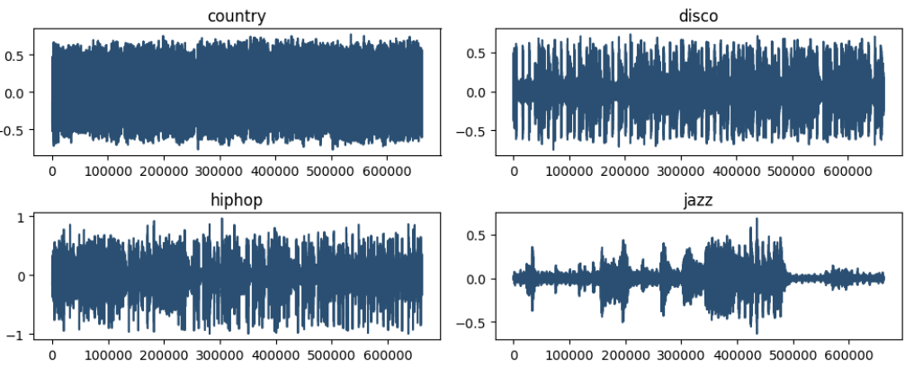
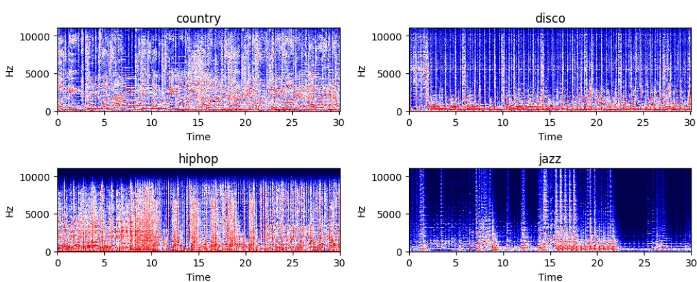
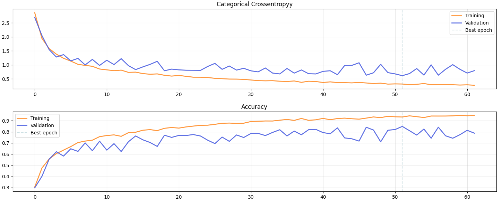
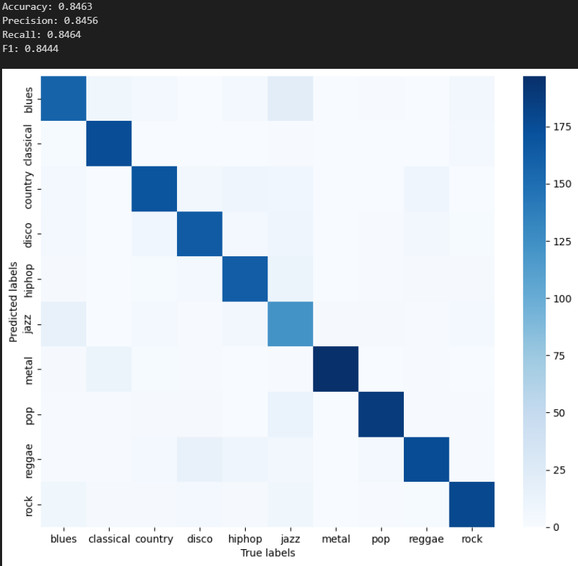
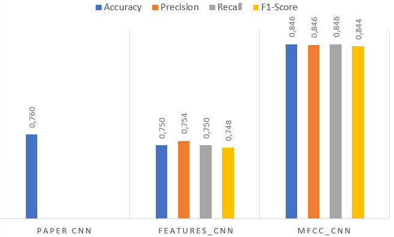

# Music Genre Classification with CNNs

## 1) Introduction  

**Project Objective**  
The goal of this project is to classify music tracks into genres using Convolutional Neural Networks (CNNs) on the GTZAN dataset.  
The analysis compares two approaches:

- a CNN trained on **handcrafted features** (MFCC, filter-bank and spectral contrast statistics)  
- a CNN trained directly on **MFCC-based time–frequency “images”**

The objective is to evaluate how different feature representations impact classification performance and to identify a robust pipeline for music genre classification.

---

## 2) Dataset Description  

**Source**  
The dataset used is the **GTZAN Genre Collection**, a standard benchmark for music genre classification. It contains:

- **1,000 audio tracks**  
- **10 genres** (blues, classical, country, disco, hip-hop, jazz, metal, pop, reggae, rock)  
- each track is **30 seconds** long, originally sampled at ~22 kHz  

After preprocessing and framing into 3-second segments, the dataset yields roughly **10,000 labeled segments**.

**Target Variable**  
The target is the **music genre** of each segment, modeled as a 10-class classification problem.

**Features**  
From each audio track/segment we derive:

- raw waveforms and spectrograms (for visualization)  
- MFCCs and other spectral features used as model inputs  

### 🎼 Waveforms and Spectrograms

**Waveforms by genre**

**Spectrograms by genre**

---

## 3) Data Preprocessing  

**Signal Processing Steps**

- downsampling audio from the original sampling rate to **16 kHz**  
- conversion to **mono** to reduce dimensionality  
- **framing**: each 30-second track is split into **3-second segments**, increasing the number of training samples while preserving the genre label  

This yields a larger dataset of short segments, each associated with one of the 10 genres.

---

## 4) Feature Engineering  

Two main feature representations are explored:

**Handcrafted Feature Aggregation**  
For each 3-second segment we compute:

- **MFCC** (Mel-Frequency Cepstral Coefficients)  
- **DFB** (Decorrelated Filter Bank features)  
- **OSC** (Octave-based Spectral Contrast)

For each feature type and frequency band, we compute **mean** and **variance** over time.  
These statistics are then stacked into a compact **6×7 matrix** (6 = mean/variance × 3 feature families, 7 = frequency bands), which acts as a 2D input for a CNN.

**MFCC “Image” Representation**  
In the second approach, we treat MFCCs as **time–frequency images**:

- we compute MFCCs over time for each segment  
- we obtain a matrix of shape roughly `(n_mfcc, n_frames)` (e.g., 20 × 94)  
- this matrix is interpreted as a **single-channel image** and fed directly into a CNN

---

## 5) Model Architectures  

**CNN on Handcrafted Features**  

- **Input**: 6×7×1 feature matrix (MFCC + DFB + OSC statistics)  
- **Architecture**: small 2D CNN with convolutional layers, ReLU activations, max pooling, dropout and fully-connected layers  
- **Output**: softmax over 10 genres  

**CNN on MFCC Images**  

- **Input**: MFCC “image” (e.g., 20×94×1)  
- **Architecture**: deeper 2D CNN with multiple Conv2D–BatchNorm–ReLU–MaxPooling blocks, followed by dense layers and dropout to reduce overfitting  
- **Output**: softmax over 10 genres  

---

## 6) Training and Evaluation  

**Data Splitting**  
The dataset of 3-second segments is split into:

- training set  
- validation set  
- test set  

ensuring that segments from the same original track do not leak across splits.

**Training Procedure**

- categorical cross-entropy loss for multi-class classification  
- optimization with mini-batch gradient descent (e.g., Adam)  
- early stopping based on validation performance to prevent overfitting  

### 📉 Training Curves (MFCC CNN)

**Metrics**

- **accuracy** as the main metric  
- optional precision, recall and F1-score per genre  
- confusion matrices to inspect common misclassifications  

### 🔎 Confusion Matrix (MFCC CNN)

---

## 7) Model Comparison  

**Handcrafted Features CNN**

- provides a strong baseline using compact statistical descriptors of MFCC, DFB and OSC  
- achieves reasonable accuracy, confirming that engineered features carry useful genre information  

**MFCC Image CNN**

- exploits the full time–frequency structure of MFCCs  
- achieves higher test accuracy (around the mid-80% range) and better overall F1-score compared to the handcrafted approach  

Overall, the MFCC-image CNN is selected as the **best-performing model**, indicating that less compressed representations allow CNNs to learn richer discriminative patterns.

### 📊 Model Comparison

---

## 8) Conclusions and Future Work  

**Key Insights**

- short 3-second segments are sufficient to learn meaningful genre-specific patterns  
- CNNs trained on MFCC “images” outperform those trained on heavily aggregated handcrafted features  
- time–frequency representations are effective for music genre classification tasks  

**Future Directions**

- introduce **data augmentation** at the audio level (time stretching, pitch shifting, noise)  
- experiment with more advanced architectures (ResNet-like CNNs, CRNNs combining CNN and RNN)  
- extend the approach to **multi-label** tasks or **mood/emotion classification**  
- deploy a small demo to classify user-uploaded audio clips  
